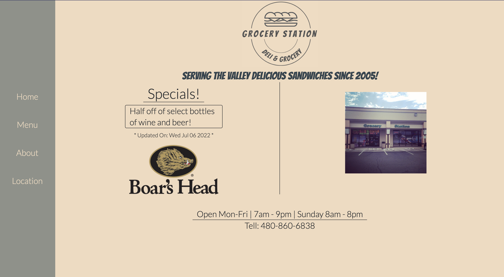

# Grocery Station

## About This Project :

Grocery Station is a local deli and small grocery store located in Scottsdale, AZ! Decided to build out a modular website to promote their brand and give the owners access to update aspects of the website protected by a login system.

## Features :

- Designed to be simple yet smooth with a multi-page layout using react router.
- Incorporated a Carousel with a bootstrap react component on the home page to view pictures related to Grocery Station
- Functionality to add or change weekly or daily specials that automatically provide the day it was changed or updated.
- Ability to login via /admin route to provide access to some edit and add functionality.
- Created a page to view where Grocery Station is located on a map provided by Google. 📍

## Built With :

- ![node.js]
- ![react.js]
- ![reactRouter]
- ![express.js]
- ![mongodb]
- ![heroku]
- ![HTML5]
- ![CSS3]
- ![tailwind]
- ![bootstrap]

<!-- USAGE EXAMPLES -->

# Views

(<a href="#top">back to top</a>)

[node.js]: https://img.shields.io/badge/Node.js-43853D?style=for-the-badge&logo=node.js&logoColor=white
[react.js]: https://img.shields.io/badge/React-20232A?style=for-the-badge&logo=react&logoColor=61DAFB
[bootstrap]: https://img.shields.io/badge/Bootstrap-563D7C?style=for-the-badge&logo=bootstrap&logoColor=white
[reactrouter]: https://img.shields.io/badge/React_Router-CA4245?style=for-the-badge&logo=react-router&logoColor=white4
[tailwind]: https://img.shields.io/badge/Tailwind_CSS-38B2AC?style=for-the-badge&logo=tailwind-css&logoColor=white
[html5]: https://img.shields.io/badge/HTML5-E34F26?style=for-the-badge&logo=html5&logoColor=white
[css3]: https://img.shields.io/badge/CSS3-1572B6?style=for-the-badge&logo=css3&logoColor=white
[express.js]: https://img.shields.io/badge/Express.js-404D59?style=for-the-badge
[mongodb]: https://img.shields.io/badge/MongoDB-4EA94B?style=for-the-badge&logo=mongodb&logoColor=white
[heroku]: https://img.shields.io/badge/Heroku-430098?style=for-the-badge&logo=heroku&logoColor=white
